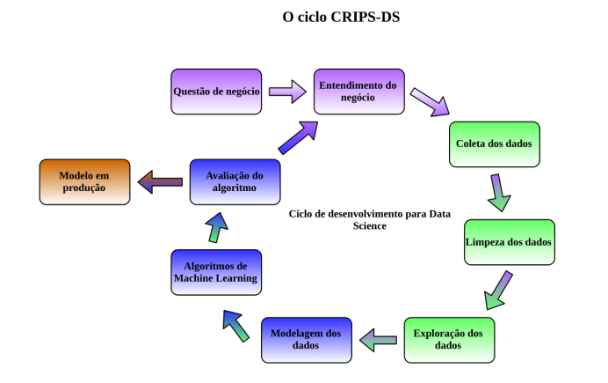

<h1 align="center">
   Predição e Propensão de Compra de Serviço de Seguro 
</h1>

<h1 align="center">
  
</h1>

OBS: O contexto de negócios é fictício, porém todo o planejamento e desenvolvimento da solução é implementado seguindo todos os passos de um projeto de mercado real.

## 1. Problema de Negócio
    
### 1.1 Negócio

A Insurance Full é uma companhia de seguros que fornece seguro de saúde para seus clientes. 

No seguro de saúde, existe o conceito de apólice de seguro, que são garantias que a empresa se compromete a cobrir por perda, dano, doença ou morte especificada em troca do pagamento de um prêmio acordado. O prêmio é a soma de dinheiro que o cliente precisa desembolsar regularmente a uma companhia de seguros por esta garantia.

### 1.2 Contexto/Motivação da Problemática

A empresa visa lançar um novo produto voltado para seguro de automóveis, inclusive o primeiro passo foi a elaboração e aplicação de uma pesquisa com aproximadamente 304 mil clientes de seguro de saúde para compreender o interesse em seguro de automóveis. Contudo, a lista de clientes interessados para esse novo serviço é extensa e a área comercial necessita priorizar os esforços para entrar em contato direto com as pessoas com maior propensão de compra. 

O objetivo imediato do time comercial, é abordar uma amostra da base de clientes atual de forma assertiva com base na probabilidade de compra dos clientes. O objetivo futuro do time comercial, é possuir uma ferramenta para uso diário que possa auxiliar na análise de probabilidade de compra de clientes antigos ou novos. 

Para isso, o time de dados foi acionado para apresentar uma solução.

### 1.3 Entendimento do Problema de Negócio

- **Problema/Questão de Negócio:**  *O que?* 

Classificar pessoas com potencial interesse em comprar novo serviço e mensurar esse interesse de forma a priorizá-las.

- **Causa Raiz do Problema:**  *Porque realizar esse projeto?* 

Ser assertivo em abordar pessoas mais propensas a comprar o novo serviço através da extração de conhecimento da pesquisa com a base de clientes atual que a empresa dispõe e investiu recurso. Assim, reduzindo os custos e esforços da operação, obtendo retorno mais rápido. 

- **Dono do Problema:** *Principal parte interessada?*

Diretor Comercial e Diretor de Produto.

## 2. Planejamento da Solução

### 2.1 Produto Final

Mediante aprofundamento da problemática feita com às partes interessadas, alinhou-se as expectativas quanto ao formato da entrega. 

1) O produto final será construir um ranqueamento por critério de interesse (propensão de compra) com base nos dados coletados da pesquisa feita com 304 mil clientes de seguro de saúde. Essa funcionalidade deve ser desenvolvida na ferramenta Google Sheets onde encontra-se a listagem com os dados de 76 mil potenciais clientes atuais que não responderam a pesquisa.

2) Além disso, algumas questões de negócio pontuais foram requeridas:

- Quais são os principais insights sobre os atributos mais relevantes de clientes interessados em seguro para automóvel?

- A área comercial alinhou com a área de produto, visando otimizar a operação, que o time de Outbound possui capacidade de entrar em contato direto com apenas 20 mil potenciais clientes, sendo assim, qual a porcentagem de clientes interessados em seguro para automóvel o time de Outbound da área comercial conseguirá contatar?

- Se a capacidade do time de Outbound aumentar para 40 mil ligações, qual a porcentagem de potenciais clientes interessados em adquirir um seguro para automóvel o time de Outbound conseguirá contatar?

- Quantas ligações o time de Outbound precisa fazer para contatar 80% dos clientes interessados em adquirir um seguro para automóvel ?

### 2.2 Processo

A estratégia adotada para resolver a problemática é baseada na metodologia de gerenciamento de projeto CRISP-DS. 

<h1 align="center">
  
</h1>

**Fonte:** [https://blog.magrathealabs.com/crisp-ds-cyclic-methodology-for-data-science-projects-10c7d00fbc85](https://blog.magrathealabs.com/crisp-ds-cyclic-methodology-for-data-science-projects-10c7d00fbc85)

Ela possui as seguintes etapas:

**1. Questão de Negócio:** 

Problema de negócio a ser resolvido.

**2. Entendimento do Negócio:** 

Definição das condições do problema. (Motivação, Causa Raiz, Parte Interessada, Planejamento da Solução);

**3. Coleta de Dados:** 

Extrair dados de um banco de dados na AWS Cloud com SQL via Python.

**4. Limpeza dos Dados:** 

Pode ser denominada como etapa de *Descrição dos Dados*. O objetivo é definir a grandiosidade do problema.

- Compreender o significado de cada atributo;
- Verificar a dimensão dos dados;
- Renomear colunas;
- Identificar e tratar dados nulos e duplicados;
- Analisar e garantir tipos de dados corretos;
- Aplicar estatística descritiva para analisar os atributos;
- Identificar e tratar dados outliers;
- Separar 20% dos dados para teste (aleatoriamente, mas estratificados pela variável resposta).

5. **Exploração dos Dados:**  

Engloba as etapas de *Feature Engineering*, *Filtragem de Variáveis* e *Análise Exploratória de Dados (EDA)* de um projeto de Ciência de Dados.

Objetivo é compreender as variáveis/atributos que impactam o fenômeno (*target*) de análise e gerar insights de negócio.

5.1. *Feature Engineering:* 

  Objetivo é ter as variáveis disponíveis para estudo durante a EDA.

  - Criar mapa mental de hipóteses;
  - Criar as hipóteses;
  - Definir hipóteses para validar a cada ciclo;
  - Criar ou ajustar os atributos (features) necessários para validação das hipóteses.

5.2. *Filtragem de Variáveis:* 

O objetivo é a definição de atributos e seus valores conforme cenário de negócio real e de interesse para a análise do fenômeno.

- Selecionar atributos baseado no critério de disponibilidade;
- Filtrar atributos de acordo com limites de interesse.
  
5.3. *Análise Exploratória de Dados (EDA):*  

Consiste em medir o impacto das features/atributos na variável resposta (fenômeno que se está avaliando).

- Realizar análise univariada, para compreender a distribuição dos dados de cada atributo;
- Realizar análise bivariada, para validar as hipóteses, gerar insights entendendo o impacto dos atributos na análise do fenômeno;
- Criar tabela de resumo dos resultados das hipóteses, e a relevância estimada dos atributos para o aprendizado dos modelos;
- Realizar análise multivariada, para visualizar colunas linearmente dependentes por meio de análise de correlação.

6. **Modelagem dos Dados:** 

Compreende as etapas de *Preparação dos Dados* e *Seleção de Features* de um projeto de Ciência de Dados.

Objetivo é preparar os dados para ensinar os algoritmos de *Machine Learning* os padrões.

6.1. *Preparação dos Dados:* 

Objetivo é garantir que os dados sejam numéricos e na mesma escala para facilitar o aprendizado dos algoritmos.

- Avaliar a distribuição de atributos numéricos para aplicar a adequada forma de padronização; (Normalização, Reescala)
- Aplicar transformações nos dados; (variáveis categóricas em numéricas (Encoding´s), de variável resposta, de natureza cíclica)
- Aplicas as preparações sob os dados de validação também.

6.2. *Seleção de Features:* 

Objetivo é selecionar atributos/características (*features*) mais relevantes para o modelo.

- Separar dados em treino ( 68% ) e validação (12%);
- Excluir de atributos que foram transformados em outros nas etapas de feature engineering e preparação dos dados;
- Definir método de seleção de features;
- Comparar sugestões do método utilizado com o resultado da relevância estimada dos atributos para o aprendizado feita na etapa de EDA;
- Definir os atributos que irão treinar os algoritmos de machine learning.

7. / 8. **Algoritmos de Machine Learning e Avaliação:** 

Compreende as etapas de treinamento de algoritmos e avaliação, otimização dos parâmetros e avaliação do algoritmo final.

Objetivo é ensinar os algoritmos de machine learning com dados de treino, para que possam aprender o comportamento de um fenômeno com os melhores parâmetros e então, possam generalizá-los para exemplos futuros. E assim, trazer o retorno de negócio esperado para a aplicação requerida.

- Definir algoritmos a serem aplicados, desde mais simples a mais complexos;
- Definir métricas de avaliação de desempenho e aplicar sob os dados de validação;
- Avaliar desempenho dos algoritmos com o método de validação cruzada;
- Definir um algoritmo para estar na aplicação final;
- Realizar otimização de parâmetros desse algoritmo por meio de uma estratégia definida;
- Avaliar a performance do algoritmo final sob aspecto de *Machine Learning*;
- Avaliar a performance do algoritmo final sob aspecto de Negócios.

9. **Modelo em Produção:** 

Objetivo é tornar os resultados do modelo acessível para qualquer consumidor (pessoa, celular, app, website, Google Sheets, Excel, qualquer software conectado na internet que possa fazer requisição em API).

- Criar uma classe com todos os métodos necessários para que o algoritmo final receba os dados em produção da mesma como foi treinado e realize a predição;
- Construir API para colocar o modelo e o projeto de dados para serem acessados;
- Testar a API localmente;
- Publicar API em servidor na nuvem;
- Testar localmente a API em produção;
- Definir e desenvolver ferramenta de acesso/consulta aos dados em produção.

### 2.3 Ferramentas

- Python 3.8.15;
- Pandas, Seaborn, Matplotlib e Sklearn;
- Flask e Python API's;
- Git e GitHub;
- Ambiente Virtual Anaconda;
- Jupyter Notebook;
- Atom;
- Algoritmos de Classificação e de Ranqueamento com as bibliotecas Sklearn e Xgboost;
- Google Sheets Apps Script;
- Render Cloud.