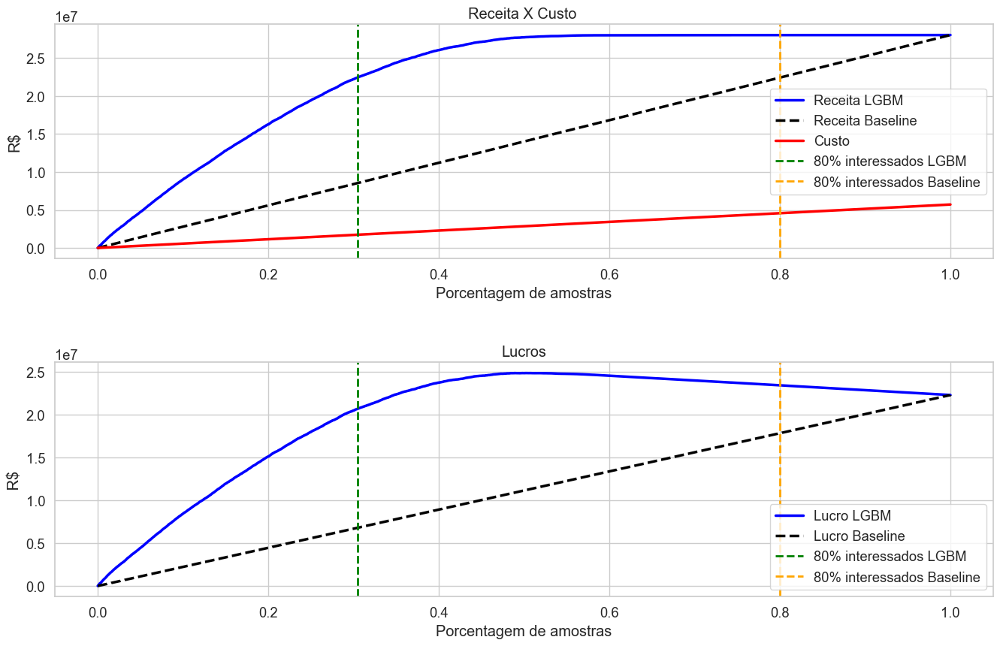

<h1 align="center">
   Predição e Propensão de Compra de Serviço de Seguro 
</h1>

<h1 align="center">
  
</h1>

**OBS:** O contexto de negócios é fictício, porém todo o planejamento e desenvolvimento da solução é implementado seguindo todos os passos de um projeto de mercado real.

## 1. Problema de Negócio
    
### 1.1 Negócio

A Insurance All é uma companhia de seguros que fornece seguro de saúde para seus clientes. 

No seguro de saúde, existe o conceito de apólice de seguro, que são garantias que a empresa se compromete a cobrir por perda, dano, doença ou morte especificada em troca do pagamento de um prêmio acordado. O prêmio é a soma de dinheiro que o cliente precisa desembolsar regularmente a uma companhia de seguros por esta garantia.

### 1.2 Contexto/Motivação da Problemática

A empresa desenvolveu e está iniciando a operação de um novo serviço, o seguro de automóveis, para isso visa iniciar a operação utilizando a estratégia de *Cross-Sell*. *Cross-Sell*, ou venda cruzada, refere-se à venda de produtos ou serviços relacionados e complementares com base no interesse do cliente ou na compra de um produto.

Uma das etapas fundamentais para o planejamento do *Cross-Sell*, segundo [artigo](https://www.salesforce.com/br/blog/2018/5/Up-Sell-e-Cross-Sell-O-Que-sao-e-como-aplicar.html) publicado pela Salesforce, é identificar os clientes adequados para o *Cross-Sell*, ou seja, identificar os clientes que deveriam receber a oferta. Com isso, o primeiro passo realizado pelo time comercial foi a elaboração e aplicação de uma pesquisa via e-mail, a qual obteve respostas de 381.109 clientes de seguro de saúde tendo intuito de coletar algumas informações e compreender o interesse em seguro de automóveis.  

Como o produto possui um alto valor agregado, a empresa adota a estratégia de prospecção mais pessoal através de ligação direta e buscando um contato mais próximo. Contudo, a lista de contatos para prospecção de clientes que não responderam a pesquisa relativo a esse novo serviço é extensa, e a área comercial necessita priorizar os esforços (tempo e custo)  para entrar em contato direto com as pessoas com maior propensão de compra. 

O objetivo do time comercial, é possuir uma ferramenta para uso diário que possa auxiliar na análise de probabilidade de compra de clientes antigos ou novos, ordenando-os com intuito de otimizar a operação de prospecção, ou seja, abordar menos pessoas e conseguir captar o maior número de interessados. 

Para isso, o time de dados foi acionado para apresentar uma solução.

### 1.3 Entendimento do Problema de Negócio

- **Problema/Questão de Negócio:**  *O que?* 

Classificar clientes com potencial interesse em comprar novo serviço e mensurar esse interesse de forma a priorizá-las.

- **Causa Raiz do Problema:**  *Porque realizar esse projeto?* 

Ser assertivo em abordar clientes mais propensos a comprar o novo serviço através da extração de conhecimento da pesquisa com a base de clientes que a empresa coletou. Assim, reduzindo os custos e esforços da operação, maximizando o lucro. 

- **Dono do Problema:** *Principal parte interessada?*

Diretor Comercial e Diretor de Produto.

## 2. Dados

Os dados para esse projeto estão disponíveis na [plataforma do Kaggle](https://www.kaggle.com/datasets/anmolkumar/health-insurance-cross-sell-prediction).

O significado dos atributos que caracterizam os dados podem ser acessados no link acima ou no [arquivo python notebook](https://github.com/alancechin/insurance_cross_sell/blob/main/notebooks/cross-sell-sprint-7.ipynb) na subseção 1.2. - *Columns Meanings*.

## 3. Premissas do negócio (*Business Assumptions*)

- As descobertas realizadas por meio de estatísticas de primeira ordem nas variáveis podem ser visualizadas no [arquivo python notebook](https://github.com/alancechin/insurance_cross_sell/blob/main/notebooks/cross-sell-sprint-7.ipynb) na subseção 1.7. - *Descriptive Statistical*; 

- Todo cliente interessado coletado via pesquisa possui 100% de probabilidade de conversão para venda;

- O custo médio total da operação em abordar uma pessoa da lista de contatos para prospecção, levando em conta tempo funcionário e gasto com forma de comunicação, é de 75,00 reais;

- A receita média que a empresa recebe ao vender um produto de seguro veicular para um cliente é de 3.000,00 reais.

## 4. Planejamento da Solução

### 4.1 Produto Final

Mediante aprofundamento da problemática feita com às partes interessadas, alinhou-se as expectativas quanto ao formato da entrega. 

1) O produto final será construir um ranqueamento por propensão de compra, utilizando critério de interesse, com base nos dados coletados da pesquisa feita com 381.109 clientes de seguro de saúde. Essa funcionalidade deve ser desenvolvida na ferramenta Google Sheets onde encontra-se a listagem com os dados de 127.037 clientes que não responderam a pesquisa.

2) Além disso, algumas questões de negócio pontuais foram requeridas:

- Quais são os principais insights sobre os atributos mais relevantes de clientes interessados em seguro para automóvel?

- A área comercial alinhou com a área de produto, visando otimizar a operação, que o time de Outbound possui capacidade de entrar em contato direto com apenas 20 mil potenciais clientes, sendo assim, qual a porcentagem de clientes interessados em seguro para automóvel o time de Outbound da área comercial conseguirá contatar?

- Se a capacidade do time de Outbound aumentar para 40 mil ligações, qual a porcentagem de potenciais clientes interessados em adquirir um seguro para automóvel o time de Outbound conseguirá contatar?

- Quantas ligações o time de Outbound precisa fazer para contatar 80% dos clientes interessados em adquirir um seguro para automóvel ?

### 4.2 Processo

A estratégia adotada para resolver a problemática é baseada na metodologia de gerenciamento de projeto CRISP-DS. 

<h1 align="center">
  
</h1>

**Fonte:** [https://blog.magrathealabs.com/crisp-ds-cyclic-methodology-for-data-science-projects-10c7d00fbc85](https://blog.magrathealabs.com/crisp-ds-cyclic-methodology-for-data-science-projects-10c7d00fbc85)

Ela possui as seguintes etapas:

**1. Questão de Negócio:** 

Problema de negócio a ser resolvido.

**2. Entendimento do Negócio:** 

Definição das condições do problema. (Motivação, Causa Raiz, Parte Interessada, Planejamento da Solução);

**3. Coleta de Dados:** 

Extrair dados de um banco de dados na AWS Cloud com PostgresSQL via Python.

**4. Limpeza dos Dados:** 

Pode ser denominada como etapa de *Descrição dos Dados*. O objetivo é definir a grandiosidade do problema.

- Compreender o significado de cada atributo;
- Verificar a dimensão dos dados;
- Renomear colunas;
- Identificar e tratar dados nulos e duplicados;
- Analisar e garantir tipos de dados corretos;
- Aplicar estatística descritiva para analisar os atributos;
- Identificar e tratar dados outliers;
- Separar 20% dos dados para teste (aleatoriamente, mas estratificados pela variável resposta). Os dados de teste (representação dos dados novos) servem para simular o desempenho do modelo e estimar os impactos da aplicação da solução. 

**5. Exploração dos Dados:**  

Engloba as etapas de *Feature Engineering*, *Filtragem de Variáveis* e *Análise Exploratória de Dados (EDA)* de um projeto de Ciência de Dados.

Objetivo é compreender as variáveis/atributos que impactam o fenômeno (*target*) de análise e gerar insights de negócio.

5.1. *Feature Engineering:* 

  Objetivo é ter as variáveis disponíveis para estudo durante a EDA.

  - Criar mapa mental de hipóteses;
  - Criar as hipóteses;
  - Definir hipóteses para validar a cada ciclo;
  - Criar ou ajustar os atributos (features) necessários para validação das hipóteses.

5.2. *Filtragem de Variáveis:* 

O objetivo é a definição de atributos e seus valores conforme cenário de negócio real e de interesse para a análise do fenômeno.

- Selecionar atributos baseado no critério de disponibilidade;
- Filtrar atributos de acordo com limites de interesse.
  
5.3. *Análise Exploratória de Dados (EDA):*  

Consiste em medir o impacto das features/atributos na variável resposta (fenômeno que se está avaliando).

- Realizar análise univariada, para compreender a distribuição dos dados de cada atributo;
- Realizar análise bivariada, para validar as hipóteses, gerar insights entendendo o impacto dos atributos na análise do fenômeno;
- Criar tabela de resumo dos resultados das hipóteses, e a relevância estimada dos atributos para o aprendizado dos modelos;
- Realizar análise multivariada, para visualizar colunas linearmente dependentes por meio de análise de correlação.

**6. Modelagem dos Dados:** 

Compreende as etapas de *Preparação dos Dados* e *Seleção de Features* de um projeto de Ciência de Dados.

Objetivo é preparar os dados para ensinar os algoritmos de *Machine Learning* os padrões.

6.1. *Preparação dos Dados:* 

Objetivo é garantir que os dados sejam numéricos e na mesma escala para facilitar o aprendizado dos algoritmos.

- Avaliar a distribuição de atributos numéricos para aplicar a adequada forma de padronização; (Normalização, Reescala)
- Aplicar transformações nos dados; (variáveis categóricas em numéricas (Encoding´s), de variável resposta, de natureza cíclica)
- Aplicar as preparações sob os dados de validação também.

6.2. *Seleção de Features:* 

Objetivo é selecionar atributos/características (*features*) mais relevantes para o modelo.

- Excluir de atributos que foram transformados em outros nas etapas de feature engineering e preparação dos dados;
- Definir método de seleção de features;
- Comparar sugestões do método utilizado com o resultado da relevância estimada dos atributos para o aprendizado feita na etapa de EDA;
- Definir os atributos que irão treinar os algoritmos de machine learning.

**7. Algoritmos de Machine Learning e Avaliação:** 

Compreende as etapas de treinamento de algoritmos e otimização dos parâmetros (etapa de validação),  avaliação dos algoritmo(s) finais em dados nunca vistos.

O objetivo é ensinar os algoritmos de *machine learning* com dados de treino, para que possam aprender o comportamento de um fenômeno com os melhores parâmetros e então, possam generalizá-los para exemplos nunca vistos. E assim, trazer o retorno de negócio esperado para a aplicação requerida.

- Definir algoritmos a serem aplicados, desde mais simples a mais complexos;
- Definir métricas de avaliação de desempenho e aplicar sob os dados de validação utilizando método de validação cruzada;
- Definir estratégia de otimização de parâmetros para detectar parâmetros que fazem os modelos performarem melhor;
- Definir melhores algoritmo(s) e seus melhores parâmetros para aplicar nos dados de teste e avaliar desempenho;
- Definir um algoritmo com seus melhores parâmetros para colocar em produção;
- Avaliar a performance do algoritmo final sob aspecto de *Machine Learning*.

**8. Tradução e Interpretação:**

Converter resultados do modelo de *machine learning* em métricas de negócio, ou seja, se o modelo for implementado qual a efetividade dele na tarefa pretendida convertendo para valores financeiros.

- Responder as questões de negócio requeridas sob os dados de teste;
- Avaliar a performance do algoritmo final implementado no contexto do negócio sob aspecto financeiro (receita, custo e lucro).

**9. Modelo em Produção:** 

Objetivo é tornar os resultados do modelo acessível para qualquer consumidor (pessoa, celular, app, website, Google Sheets, Excel, qualquer software conectado na internet que possa fazer requisição em API).

- Criar uma classe com todos os métodos necessários para que o algoritmo final receba os dados em produção transformados da mesma forma como foi treinado e realize a predição;
- Construir API para colocar o modelo e o projeto de dados para serem acessados;
- Testar a API localmente;
- Publicar API em servidor na nuvem;
- Testar localmente a API em produção;
- Definir e desenvolver ferramenta de acesso/consulta aos dados em produção.

### 4.3 Ferramentas

- Python 3.8.15;
- Pandas, Seaborn, Matplotlib e Sklearn;
- Flask e Python API's;
- Git e GitHub;
- Ambiente Virtual Anaconda;
- Jupyter Notebook;
- Atom;
- Algoritmos e Métricas para resolver tarefa de *LearnToRank*;
- Google Sheets Apps Script;
- Render Cloud.

## 5. Principais insights 

**H1:** Clientes com mais idade (acima de 50) deveriam ter maior interesse, em média, na compra de seguro veicular.

❌ **Falsa:** 
      
**Análises:**

- Na base de clientes de seguro de saúde existem uma maior quantidade pessoas com idade entre 20 e 30 anos;

- Porém, clientes na faixa de 31 a 40 anos e 41 a 50 anos a proporção de interessados é superior a 20%, sendo as maiores;

**Conclusão:**

- Clientes com meia idade (30 a 50 anos) possuem, em média, maior interesse em seguro veicular.

<h1 align="center">
  
</h1>
      

**H2:** Clientes do gênero Feminino deveriam ter, em média, maior interesse na compra de seguro veicular.

 ❌ **Falsa:** 
 
 **Análises:**

- 13,8% dos clientes do gênero masculino estão interessados, isso representa 22.751 clientes;

- 10,4% dos clientes do gênero feminino estão interessados, isso representa 14.617 clientes;

**Conclusão:**

O gênero masculino possui maior interesse, em média, em comprar seguro veicular do que o gênero feminino.

<h1 align="center">
  
</h1>

**H7:** Clientes com automóvel mais novo (menos de um ano) deveriam ter, em média, maior interesse na compra de seguro veicular.

❌ **Falsa:** 

**Análises:**
    
- De acordo com a proporção de clientes interessados na base por idade do veículo, quem possui veículo com mais de 1 ano têm maior interesse em seguro veicular do que os que possuem veículo com idade menor de 1 ano (4,4%).  

- Clientes com veículo que possui mais de 2 anos a proporção de interessados é a maior com 29,28%.

**Conclusão:**

- Existe claramente uma tendência diretamente proporcional entre o interesse e a idade do veículo. Quanto maior a idade do veículo do cliente, existe mais interesse em seguro veicular.

<h1 align="center">
  
</h1>

**OBS:** Mais hipóteses de negócio foram também validadas e estão presentes na subseção 4.2. Análise Bivariada no [arquivo python notebook](https://github.com/alancechin/insurance_cross_sell/blob/main/notebooks/cross-sell-sprint-7.ipynb).

## 6. Modelos de Machine Learning

Como a solução pretendida é a tarefa de ordenação, conhecida na literatura como *Learning to rank*, o qual é uma variação da tarefa de classificação utilizando aprendizado por supervisão, algumas adaptações da tarefa tradicional em termos de compreensão foram necessárias para desenvolver o produto final. Uma delas, foi entender que o objetivo pretendido do algoritmo é predizer a probabilidade de cada cliente no interesse (fenômeno) em comprar produto de seguro veicular, e não simplesmente predizer se o cliente possui o interesse ou não possui o interesse, como na tarefa de classificação.  

Utilizou-se 5 algoritmos os quais receberam dados de treino para aprenderem aspectos sob o fenômeno de interesse em comprar o novo produto:

- Naive Bayes
- K-Nearest Neighbors
- Regressão Logística
- Random Forest 
- Light Gradient Boosting Machine (LGBM)

O objetivo inicial foi avaliar a capacidade de aprendizado do algoritmo, a qual compreende-se por **etapa de validação**. Para isso, utilizou-se o método de validação cruzada (*cross validation*), o qual consiste em dividir o conjunto de dados de treino em diversas partes para medir a performance em cada uma delas (1ª parte de validação e o restante de treinamento), e assim, medir a performance real dos modelos de Machine Learning evitando vieses de amostragem. 

Concomitantemente com o método de validação buscou-se os melhores parâmetros para os algoritmos, utilizando a estratégia de teste de parâmetros dos modelos de forma aleatória (*Random Search*).   

Outra adaptação da tarefa de classificação, foi em definir a métrica de performance dos modelos a qual pudesse monitorar a eficiência na tarefa de ordenação, para isso utilizou-se:

Precision@K (*Precision at* K): De todas as predições realizadas pelo modelo até K amostras/observações ordenadas, quantas são da classe desejada.

As melhores performances de cada algoritmo em ordem crescente, com seus melhores parâmetros na etapa de validação foram:

| Modelo | Parâmetros | Precision@20000 Treino | Precision@20000 Validação |
|--------|-----|------|------|
| LGBM | {'n_estimators': 500, 'learning_rate': 0,05, 'class_weight': 'balanced', 'max_depth': 9,'subsample': 0,7, 'colsample_bytree': 0,3, 'min_child_weight': 0,001}| 0,42 +/- 0,0014 | 0,31 +/- 0,0012|
| Random Forest | {'n_estimators': 2500, 'min_samples_split': 2, 'max_depth': 5, 'criterion': 'gini', 'class_weight: balanced}| 0,37 +/- 0,002| 0,31 +/- 0,0013|
| Logistic Regression | {'solver': 'saga', 'class_weight': 'balanced', 'C': 1,05} | 0,34 +/- 0,0017 | 0,31 +/- 0,0019 |
| KNN | {'n_neighbors': 19, 'metric': 'euclidean'}	 |0,46 +/- 0,0021| 0,29 +/- 0,0015 |
| Naive Bayes | {'var_smoothing': 1e-09}	 | 0,31 +/- 0,00039 | 0,29 +/- 0,0013|

**OBS:** As razões para escolha da métrica, bem como, o parâmetro K e outros aspectos do processo de aplicação dos algoritmos está descrito em [arquivo python notebook](https://github.com/alancechin/insurance_cross_sell/blob/main/notebooks/cross-sell-sprint-7.ipynb) na subseção 7.0. - *Modelos de Machine Learning*. 

Os modelos que obtiveram melhores resultados foram o LGBM, Random Forest e o Regressão Logística. Porém, LGBM e o Random Forest acabaram tendo seus resultados de treino e validação bastante *overfittados* (sobreajuste). Ou seja, os modelos com os parâmetros escolhidos treinados pelo otimizador Random Search possuem bom resultado em dados de treino mas possuem desempenho menor para dados nunca vistos (poder de generalização baixo).

Pelo poder computacional da máquina atrelado ao otimizador escolhido, não foi possível testar todos os parâmetros dos modelos, sendo essa uma possível razão para que os algoritmos LGBM e Random Forest possam ter apresentado overfitting. Em um cenário ideal mais parâmetros deveriam ser testados para averiguar os melhores modelos.

Assumindo o *overfitting* nos modelos Random Forest e LGBM, levou-se esses dois e o Logistic Regression para a etapa de teste com seus melhores parâmetros encontrados para assim, definir o algoritmo colocado em produção.

Na **etapa de teste**, o objetivo  é avaliar a capacidade de generalização (sob dados nunca vistos) dos modelos simulando o comportamento da solução em produção. Os resultados de desempenho para cada algoritmo foram: 

| Modelo | Precision@20000 Teste | 
|--------|------|
| LGBM |  33,55% |
| Random Forest | 32,97% |
| Logistic Regression | 32,60% |

Além da precision@k, para definir qual algoritmo deve ir para produção foi analisado graficamente o desempenho de cada modelo nas curvas de Ganho Cumulativo e Lift. A curva de Ganho Cumulativo proporciona a partir da quantidade de amostras a qual deseja-se ranquear, a eficiência da ordenação com relação a priorizar nas primeiras posições amostras da variável resposta pretendida. A curva Lift propicia compreender quantas vezes o algoritmo de ordenação desenvolvido no projeto é melhor que um modelo de média (baseline) que iria ordenar a lista de forma aleatória.

Como o desempenho de cada algoritmo se mostrou bastante próximo nas curvas plotadas, assim como já observado no resultado da métrica precision@k, definiu-se que o modelo a ser colocado em produção seria o LGBM. O tamanho do modelo final treinado ficou com aproximadamente 1,7 MB.

## 7. Resultados de Negócio

Nessa etapa o objetivo foi responder as questões de negócio solicitadas no início do projeto pelo time de produto e comercial, convertendo a performance do modelo final LGBM em valores financeiros caso o modelo fosse implementado.

### 7.1.  A área comercial alinhou com a área de produto, visando otimizar a operação, que o time de Outbound possui capacidade de entrar em contato direto com apenas 20 mil potenciais clientes, sendo assim, qual a porcentagem de clientes interessados em seguro para automóvel o time de Outbound da área comercial conseguirá contatar ?

<h1 align="center">
  
</h1>

Considerando que na lista total de clientes teste com 76.222 clientes existem no total 9.342 interessados. A curva de Ganho Acumulado mostra com clareza baseado na quantidade de amostras a qual deseja-se abordar, a porcentagem de interessados em comprar. 

Assim sendo, o time da área comercial conseguirá contatar 71,82% de clientes interessados em seguro para automóvel utilizando o algoritmo de ordenação treinado nesse projeto. (representa contatar aproximadamente 6.710 pessoas interessadas das 20.000 abordadas) 

Com o modelo de ordenação aleatória (baseline), a área comercial iria conseguir contatar 26,24% dos interessados. (representa contatar aproximadamente 2.451 pessoas interessadas das 20.000 abordadas)

Com a curva Lift, pode-se verificar que o algoritmo de classificação LGBM treinado para a tarefa de ordenação é 2,73 vezes melhor que o modelo de ordenação aleatória (baseline) na tarefa de ordenar 20.000 clientes.

De acordo com as premissas de custo e receita definidas:

<h1 align="center">
  
</h1>

- O custo médio da operação para prospectar 20.000 pessoas é de 1.500.000,00 reais.

Ordenação via Algoritmo LGBM treinado:

- A operação de prospecção de 20.000 pessoas ordenadas gera para empresa uma receita média estimada de 20.130.000,00 reais.

- O lucro médio total está estimado em 18.630.000,00 reais.

Ordenação via modelo aleatório (Baseline):

- A operação de prospecção de 20.000 pessoas ordenadas aleatoriamente geraria para empresa uma receita média estimada de 7.353.000,00 reais.

- O lucro médio total está estimado em 5.853.000,00 reais.

CONCLUSÃO: Ao utilizar o modelo de *machine learning* desenvolvido nesse projeto para priorizar a prospecção de 20.000 pessoas de uma lista de 76.222 ao invés de escolher aleatoriamente, a empresa terá um lucro adicional de 12.777.000,00 reais. 

### 7.2. Se a capacidade do time de Outbound aumentar para 40 mil ligações, qual a porcentagem de potenciais clientes interessados em adquirir um seguro para automóvel o time de Outbound conseguirá contatar ?

<h1 align="center">
  
</h1>

O time da área comercial conseguirá contatar 99,38% de clientes interessados em seguro para automóvel utilizando o algoritmo de ordenação treinado nesse projeto.
(representa contatar aproximadamente 9.283 pessoas interessadas das 40.000 abordadas) 

Com o modelo de ordenação aleatória (*baseline*), a área comercial iria conseguir contatar 52,48% dos interessados. (representa contatar aproximadamente 4.902 pessoas interessadas das 40.000 abordadas)

Com a curva Lift, pode-se verificar que o algoritmo de classificação LGBM treinado para a tarefa de ordenação é 1,89 vezes melhor que o modelo de ordenação aleatória (*baseline*) na tarefa de ordenar 40.000 clientes.

De acordo com as premissas de custo e receita definidas:

<h1 align="center">
  
</h1>

- O custo médio da operação para prospectar 40.000 pessoas é de 3.000.000,00 reais.

Ordenação via Algoritmo LGBM treinado:

A operação de prospecção de 40.000 pessoas ordenadas geraria para empresa uma receita média estimada de 27.852.000,00 reais.

O lucro médio total estaria estimado em 24.852.000,00 reais.

Ordenação via modelo aleatório (Baseline):

A operação de prospecção de 40.000 pessoas ordenadas aleatoriamente geraria para empresa uma receita média estimada de 14.706.000,00 reais.

O lucro médio total estaria estimado em 11.706.000,00 reais.

CONCLUSÃO: Ao utilizar o modelo de *machine learning* desenvolvido nesse projeto para priorizar a prospecção de 40.000 pessoas de uma lista de 76.222 ao invés de escolher aleatoriamente, a empresa terá um lucro adicional de 13.146.000,00 reais.

### 7.3. Quantas ligações o time de Outbound precisa fazer para contatar 80% dos clientes interessados em adquirir um seguro para automóvel ?

<h1 align="center">
  
</h1>

Com o modelo treinado para tarefa de ordenação seriam necessárias 23.207 ligações para atingir 80% dos reais interessados. Seria necessário ligar para 30,44% da base. Nesse cenário, o modelo treinado seria 2,63 vezes melhor que o modelo *baseline*.

Em contrapartida, com o modelo baseline seriam necessárias 60.978 ligações para atingir 80% dos reais interessados. Seria necessário ligar para 80% da base. Nesse cenário, o modelo treinado seria 1,25 vezes melhor que o modelo *baseline*.

De acordo com as premissas de custo e receita definidas, para atingir 80% dos interessados:

<h1 align="center">
  
</h1>

Ordenação via Algoritmo LGBM treinado:

- O custo médio da operação para prospectar 23.207 pessoas (80% interessados) é de 1.740.525,00 reais.

- A operação de prospecção geraria para a empresa uma receita média estimada de 22.422.000,00 reais.

- O lucro médio total estaria estimado em 20.681.475,00 reais.

Ordenação via modelo aleatório (*Baseline*):

- O custo médio da operação para prospectar 60.978 pessoas (80% interessados) é de 4.573.350,00 reais.

- A operação de prospecção geraria para empresa uma receita média estimada de 22.419.000,00 reais.

- O lucro médio total estaria estimado em 17.845.650,00 reais.

CONCLUSÃO: Ao utilizar o modelo de *machine learning* desenvolvido nesse projeto para atingir 80% dos interessados ao invés de escolher aleatoriamente, a empresa além de ter um lucro adicional de 2.835.825,00 reais, conseguiria alcançar isso fazendo 37.771 ligações/prospecções a menos.

Além disso, uma entrega extra do time de dados para o time comercial e de produto foi a seguinte:

### 7.4. Quantidade de pessoas para abordar e obter lucro médio total máximo da operação

<h1 align="center">
  
</h1>

De acordo com as premissas de custo e receita definidas:

- O lucro médio máximo da operação de prospecção da lista de contatos ordenada pelo algoritmo LGBM é atingido ao abordar 50,24% (38.298) da base total de contatos.

- O custo médio da operação para prospectar 38.298 pessoas, as quais representam aproximadamente 99% dos interessados é de 2.872.350,00 reais.

- A operação de prospecção geraria para empresa uma receita média estimada de 27.747.000,00 reais.

Com isso, o lucro médio estaria estimado em 24.874.650,00 reais.

Em contrapartida, utilizando a ordenação via modelo aleatório (Baseline) para abordar a mesma quantidade de pessoas da base:

- A operação de prospecção geraria para empresa uma receita média estimada de 14.079.000,00 reais.

O lucro médio total estaria estimado em 11.206.650,00 reais.

CONCLUSÃO: Ao utilizar o modelo de *machine learning* desenvolvido nesse projeto ao invés de escolher aleatoriamente, a empresa chegaria a um lucro máximo da operação abordando aproximadanete 50% da base total e assim, um acréscimo de lucro de aproximadamente 10 milhões.

OBS: O modelo aleatório (*baseline*) atingiria seu lucro máximo na operação apenas abordando 100% da base (76.222 clientes), e esse lucro seria estimado em 22.309.350,00.

Comparando com o lucro máximo obtido pelo algoritmo LGBM desenvolvido nesse projeto esse valor é aproximadamente 2,5 milhões menor devido aos custos em prospectar a base de contatos inteira.

## 8. Modelo em Produção (*deploy*) e acesso aos dados 

Nessa etapa, criou-se uma API (*Application Programming Interface*) com biblioteca em Python e interface Web chamada Flask, a qual encapsula o algoritmo treinado e aguarda dados serem enviados para predizer os resultados pretendidos de propensão de compra para cada cliente selecionado. 

Os arquivos para a criação da API estão na pasta [webapp](https://github.com/alancechin/insurance_cross_sell/tree/main/webapp).

O objetivo foi colocar a API em ambiente de produção (servidor na nuvem), para que a aplicação pudesse estar acessível a qualquer dispositivo e consumidor com acesso a internet.   Para isso, utilizou-se a Render Cloud, a qual fornece a possibilidade de hospedar aplicações.

Após isso, o produto final de dados foi desenvolvido na ferramenta Google Sheets, por se tratar de uma ferramenta já utilizada pelo time comercial. Utilizou-se a extensão Apps Script em linguagem JavaScript para automatizar a ferramenta no acesso aos dados e requisição na API.

Na ferramenta final de dados, existe uma listagem de clientes para prospecção os quais não responderam a pesquisa, sendo assim, o objetivo é ordena-los por propensão de compra já que não possui-se a informação sobre seu interesse no produto de seguro veicular, para que o time comercial possa priorizar as prospecções, para isso recomenda-se o passo a passo: 

1. Filtrar os id´s dos potenciais clientes os quais deseja-se calcular a propensão de compra com a ferramenta de filtro do Google Sheets, para que sempre os clientes que ainda não foram preditos fiquem na linha imediatamente abaixo do cabeçalho;

3. Após isso, no menu superior procurar a opção Ranking > Calcular Propensão de Compra, para que seja calculado via algoritmo a propensão de compra para cada pessoa; 

<h1 align="center">
  
</h1>

- Em caso da lista de clientes selecionados para predizer a propensão seja pequena  ao ponto da execução do script continuar mesmo após completada, pode-se parar a execução clicando em "Cancelar";
- Em caso da lista de clientes selecionados para predizer a propensão seja elevada (> 400 aprox.)  ao ponto da execução do script cancelar automaticamente por tempo de execução, pode-se filtrar os clientes que faltaram predizer pela coluna id.

3. Após, no menu superior procurar a opção Ranking > Ordenar pela Propensão de Compra, para que a listagem seja ordenada.

*Ordenação do cliente com id 381.110 ao 381.129*
<h1 align="center">
  
</h1>

A ferramenta pode ser acessada clicando [aqui](https://docs.google.com/spreadsheets/d/1PGPrwuDbnPlF04FmIjo-fIxx6ZNJOSSh6hBY3ssR384/edit?usp=sharing).

## 9. Conclusão 

Com os resultados alcançados, o objetivo inicial foi atingido e o time comercial junto ao time de produto, podem criar estratégias com os insights trazidos sobre os clientes. Além disso, o time comercial poderá otimizar seus esforços com clientes mais propensos a comprar, desgastando menos a equipe e maximizando o lucro da empresa.

## 10. Aprendizados 

- Não deixar espaço em ajuste de valores dos atributos na etapa de *feature engineering*; 

- Explorar mais a criatividade para derivar atributos (*features*) na etapa de *feature engineering*;

- Não alterar valores dos atributos na etapa de *feature engineering* somente para facilitar a compreensão das legendas na etapa de Análise Exploratória de Dados;

- O experimento de fazer manualmente o processo de *Cross Validation* atrelado a escolha dos melhores parâmetros garantindo o não vazamento de dados (separação treino e validação antes das transformações) em comparação com o mesmo processo utilizando a função RandomizedSearchCV do Sklearn, considerando vazamento de dados demonstrou pelos resultados semelhantes entre os experimentos que o vazamento de dados possui impacto mínimo no desempenho dos modelos na etapa de validação para a problemática a ser resolvida;

- Fazer o cross validation e a otimização dos parâmetros para todos os modelos e testar é custoso (alto processamento e demorado). Em projetos futuros, o interessante seria realizar o cross validation inicial com modelos padrão e assim, selecionar 2 melhores para fazer a otimização dos parâmetros na sequência;

- Pelo poder computacional da máquina atrelado ao otimizador escolhido, não foi possível testar todos os parâmetros dos modelos, sendo essa uma possível razão para que os algoritmos LGBM e Random Forest possam ter apresentado overfitting. Em um cenário ideal mais parâmetros deveriam ser testados para averiguar os melhores modelos;

- Certificar que o salvamento das transformações dos dados na etapa de preparação utilizando a biblioteca pickle está transformando as variáveis desejadas assim como aplicar a transformação instantânea nos dados de teste;

- Certificar que no salvamento das transformações dos dados na etapa de preparação o dataset esteja com o mesmo número de atributos dos dados que serão transformados em produção.

## 11. Próximos passos

No ciclo 2:

- Coletar mais dados sobre os clientes para validar outras hipóteses e gerar novos insights para o negócio;

- Utilizar outros métodos de otimização de hiperparâmetros por meio da biblioteca Scikit-optimize;

- Testar outros tipos de transformações de variáveis na preparação dos dados, e avaliar o impacto no desempenho dos modelos;

- Usar alguma técnica para balanceamento de classes nos dados, e avaliar o impacto no desempenho dos modelos;

- Derivar outros atributos na etapa de *feature engineering* que podem ser relevantes para o aprendizado do modelo;

- No retorno financeiro, estimar a receita e lucro mediante cenários otimista, realista e pessimista. 
    - CENÁRIO OTIMISTA: De 81% a 100% dos reais interessados prospectados tornem-se clientes;
    - CENÁRIO REALISTA: De 70% a 80% dos reais interessados prospectados tornem-se clientes;
    - CENÁRIO PESSIMISTA: Abaixo de 70% dos reais interessados prospectados tornem-se clientes.

- Personalizar a ferramenta da lista de clientes para cross-sell no Google Sheets visando melhorar a experiência de uso do time comercial.

Sugestão de novo projeto a partir desse:

- Predizer quantos contatos preciso ter com cada cliente para que ele converta, aplicando técnica de ciência de dados conhecida como análise de sobrevivência.